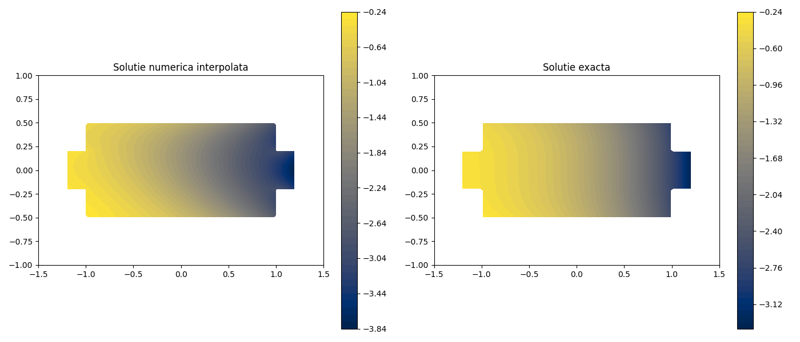
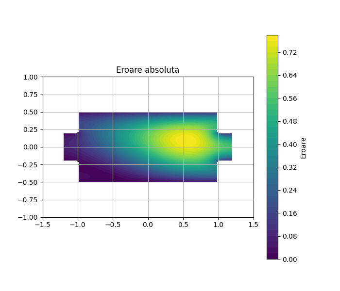
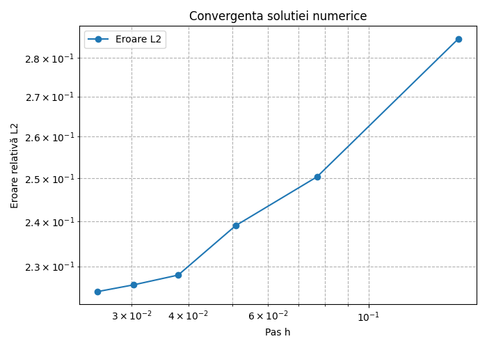

# 2D Heat Diffusion Solver (FDM)

In acest proiect am dorit sa implementez un simulator numeric pentru **ecuația de difuzie a căldurii** (Poisson) într-un domeniu bidimensional cu o geometrie interesanta, folosind metoda **Diferențelor Finite (FDM)**.

## 🚀 Concepte 
* **Geometrie Custom:** Domeniul de calcul este definit printr-un poligon (forma unui rezistor), procesat cu `matplotlib.path`.
* **Condiții la Frontieră Mixte:** * **Dirichlet:** Temperatură fixă pe anumite muchii.
  * **Neumann:** Flux de căldură controlat pe restul frontierelor.
* **Performanță:** Sistemul liniar este rezolvat eficient folosind matrici rare (`scipy.sparse`).
* **Validare:** Include un studiu de convergență pentru eroarea $L_2$ în raport cu pasul rețelei $h$.

## 📐 Modelul Matematic
Codul rezolvă ecuația de stare staționară a difuziei:
$$\nabla \cdot (k(x, y) \nabla u) = f(x, y)$$

Unde:
* $k(x, y)$ este coeficientul de conductivitate variabil.
* $f(x, y)$ este termenul sursă.
* Discretizarea se face folosind un stencil de 5 puncte (Diferențe Finite).

## 📊 Rezultate și Vizualizare

Programul generează automat trei tipuri de grafice pentru validare și analiză:

### 1. Comparație Soluții (Numerică vs. Exactă)
O vizualizare side-by-side între soluția numerică interpolată (cubic) pe un grid fin și soluția exactă teoretică.

### 2. Harta Erorii Absolute
Distribuția spațială a erorii absolute ($|u_{num} - u_{ex}|$) pe domeniul de calcul pentru a identifica zonele cu precizie scăzută.

### 3. Grafic de Convergență
Un plot log-log care demonstrează scăderea erorii relative $L_2$ odată cu rafinarea grid-ului, confirmând ordinul de precizie al metodei.

---

## 📂 Structura Codului

Scriptul Python este organizat astfel:

* **`k_func(x, y)`**: Coeficientul de conductivitate termică.
* **`u_exact(x, y)` & `f(x, y)`**: Soluția analitică și termenul sursă pentru validare.
* **`puncte_rezistor`**: Array-ul care definește poligonul geometric.
* **Procesarea Geometriei**: Folosește `Path` pentru a indexa doar punctele din interiorul figurii.
* **Asamblarea Matricii**: Construiește matricea rară $A$ și vectorul $b$ incluzând condițiile Dirichlet și Neumann.
* **Rezolvarea Sistemului**: Folosește `spsolve` pentru calculul distribuției $u$.
* **Post-procesare**: Interpolare `griddata` pe un grid fin (300x300) pentru vizualizare netedă.

## 🛠️ Obiective curente
In continuare, imi propun sa duc la un nivel mult mai ridicat acest "side quest", analizand difuzia intr-un corp 3D si cu sursa variabila de caldura, eventual diverse combinatii de materiale ale corpului. Prin aceasta, urmaresc sa imi cresc mai mult cunostintele de implementare a matematicii in "Coding". 